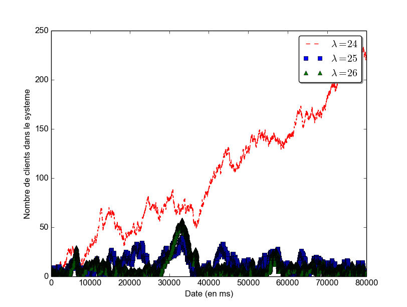
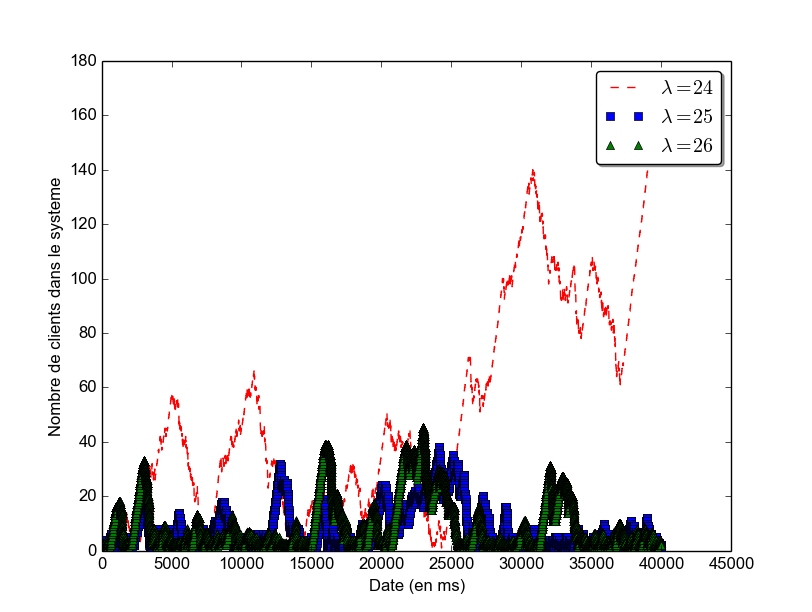

**Boedec Hoël  
Fournier Mickaël**  
ISSC - 3A

** ATTENTION ** : *Faire script pour pouvoir reproduire toutes les figures du rapport*  
** ATTENTION ** : *Un intervalle de confiance est de niveau quelque chose*

# TP Performance - Rapport

### Introduction

Nous avons choisi de développeur notre simulateur en Python car cela nous permettait de réaliser un projet dans un langage connu et répandu mais que nous n'avions jamais utilisé.

### Comment fonctionne notre générateur ?

Les événements de notre simulateur sont caractérisés par trois éléments :
  - Une date
    * La date absolue correspondant à l'éxécution de l'événement.
  - Un nom
    * Arrival : Lorsqu'un client arrive.
    * Type1 : Lorsqu'une requête de type 1 arrive au serveur.
    * Type2 : Lorsqu'une requête de type 1 arrive au serveur.
    * Departure : Lorsqu'un client a reçu une réponse à sa requête de type 2.
  - Un id
    * L'id du client auquel est associé l'événement.

Ces événemnts sont stockés dans un objet de type PriorityQueue. La particularité de la PriorityQueue est qu'elle se trie d'elle même lorsqu'un élément vient s'y rajouter. Chaque élément de cet objet regroupe deux données : la première est un nombre et la deuxième est quelconque. Le tri automatique se fait sur le nombre dans l'ordre croissant. Ceci nous convient parfaitement car nous voulons traiter les événements dans l'ordre croissant de leur date d'éxécution.

Nous donnons à notre simulateur un time_out (en ms) qui correspond à la limite de temps après laquelle le simulateur doit s'arrêter. Il ressort alors trois données :
  - Deux listes qui correspondent à l'axe des abscices et l'axe des ordonnées du graphe représentant le nombre de clients dans le système à un instant donné.
  - Une liste regroupant le temps de réponse pour tous les clients ayant quittés le système avant le time_out.

### Résultats de simulation et analyse

##### Exercice 1

1. Si on ne considère pas le paramètre &#955; (et donc l'arrivée des clients), il nous faut calculer la moyenne de chaque événement :
  - Le délai de communication entre le client et le serveur est constant. Le temps moyen est donc égal à ce délai pour chaque aller ou retour. Nous avons deux aller-retours. Ainsi, le temps moyen lors de ces trajets est de 12*2 = 24ms.
  - La moyenne d'une distribution uniforme entre sa borne min "min" et sa borne max "max" est égale à (max+min)/2. Ici nous avons "min" = 0 et "max" = 30. Ainsi, le temps moyen de traitement d'une requête de type 1 est de 15ms.
  - La moyenne d'une distribution exponentielle de paramètre "p" est égale à l'inverse de son paramètre. Ici nous avons "p" = 1/10. Ainsi, le temps moyen de traitement d'une requête de type 2 est de 10ms.
  - **Le temps moyen de réponse est donc égal à la somme de ces trois temps moyens. Soit *49ms* (24 + 15 + 10).**
2. cf partie précédente
3. //
  1. Le système nous semble stable pour un **&#955; strictement supérieur à 24.**  
  
  2. On choisit &#955;=20 et &#955;=30.  
      
    On voit que pour &#955;=20 le nombre de clients présents à un instant t ne cesse d'augmenter avec le temps alors que celui pour &#955;=30 reste stable. **TO COMPLETE**
4. On sait que pour &#955;=20 le système est instable, il n'y a pas de régime stationnaire. On ne pourra donc pas calculer la moyenne et la médiane du temps que met le serveur à répondre à une requête.  
  Pour &#955;=40 et &#955;=60 cela est possible car le système est stable.  
  L'intervalle de confiance de la moyenne est calculé à l'aide de la formule suivant : *erreur = &#963;/sqrt(n)* avec n le nombre d'échantillons de la simulation.  
  L'intervalle de confiance pour la médiane ... **TO DO**  
  1. **&#955;=40**  
    *Moyenne* = 55ms  
    *Intervalle de confiance de la moyenne* = [54.87, 55.13] (erreur = 0.13ms)
    *Médiane* = 51ms  
    *Intervalle de confiance de la médiane* = [,] (erreur = ms)
  2. **&#955;=60**  
      *Moyenne* = 49ms  
      *Intervalle de confiance de la moyenne* = [48.89, 49.11] (erreur = 0.11ms)
      *Médiane* = 48ms  
      *Intervalle de confiance de la médiane* = [,] (erreur = ms)

##### Exercice 2

1. **TO DO**  
  Peut-on avoir un intervalle de confiance ?
2. //
  1. Le système nous semble stable pour un **&#955; strictement supérieur à 24.**  
  
  2. On choisit &#955;=20 et &#955;=30.  
      
    On voit que pour &#955;=20 le nombre de clients présents à un instant t ne cesse d'augmenter avec le temps alors que celui pour &#955;=30 reste stable. **TO COMPLETE**
3. On sait que pour &#955;=20 le système est instable, il n'y a pas de régime stationnaire. On ne pourra donc pas calculer la moyenne et la médiane du temps que met le serveur à répondre à une requête.  
Pour &#955;=40 et &#955;=60 cela est possible car le système est stable.  
L'intervalle de confiance de la moyenne est calculé à l'aide de la formule suivant : *erreur = &#963;/sqrt(n)* avec n le nombre d'échantillons de la simulation.  
L'intervalle de confiance pour la médiane ... **TO DO**  
  1. **&#955;=40**  
    *Moyenne* = ms  
    *Intervalle de confiance de la moyenne* = [, ] (erreur = ms)
    *Médiane* = ms  
    *Intervalle de confiance de la médiane* = [,] (erreur = ms)
  2. **&#955;=60**  
      *Moyenne* = ms  
      *Intervalle de confiance de la moyenne* = [, ] (erreur = ms)
      *Médiane* = ms  
      *Intervalle de confiance de la médiane* = [,] (erreur = ms)

```
Le temps moyen pour lambda = 20 est de 14054.4984128ms et la médiane est 14959.7977102.
	 L'intervalle de confiance de la moyenne vaut 141.49.
Le temps moyen pour lambda = 30 est de 1415.19221438ms et la médiane est 1184.25836968.
	 L'intervalle de confiance de la moyenne vaut 36.40.

```
